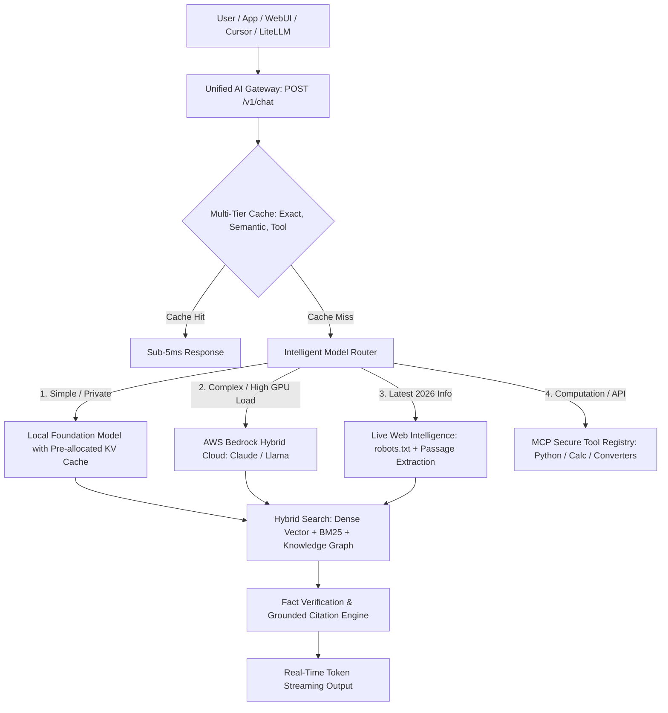

# IndicLLM-Bharat: Universal Hybrid AI Operating Environment Architecture

## 1. System Overview

IndicLLM-Bharat is an enterprise-grade, high-performance, continuously updated AI operating environment architected around:
**Local Sovereign LLM + AWS Bedrock Cloud + Multi-Stage Hybrid RAG + Live Web Retrieval + Knowledge Graph + Vector Search + BM25 Lexical Matching + Intelligent Routing + Multi-Tier Caching + Continuous Ingestion + MCP Tools + Fact Verification & Grounded Citations**.

---

## 2. End-to-End Architectural Diagram

---

## 3. Core Architectural Subsystems

1. **Intelligent Model Router (`bharat/routing/router.py`)**: Classifies query intent, temporal freshness, privacy constraints, and computational complexity to route tasks optimally.
2. **Multi-Stage Hybrid Search (`bharat/rag/hybrid_search.py`)**: Merges semantic dense vectors with BM25 keyword matching via Reciprocal Rank Fusion (RRF) and Knowledge Graph relational traversals.
3. **Live Web Intelligence Subsystem (`bharat/web/intelligence.py`)**: Retrieves, deduplicates, and ranks real-time information from compliant public web sources with multi-dimensional credibility scoring.
4. **Continuous Ingestion Pipeline (`bharat/ingestion/pipeline.py`)**: Ingests multi-format documents (PDF, DOCX, CSV, TXT, Code) with resumable checkpoints, SHA-256 deduplication, and version tracking.
5. **AWS Bedrock Hybrid Cloud (`bharat/cloud/bedrock_client.py`)**: Provides managed cloud failover and prompt caching with automatic local fallback.
6. **MCP Secure Tool Registry (`bharat/tools/mcp_server.py`)**: Standard dynamic tool discovery for calculators, unit converters, and sandboxed executors.
7. **Fact Verification Engine (`bharat/verification/verifier.py`)**: Validates cross-source consensus, detects contradictions, and attributes numbered traceable citations.
8. **Multi-Tier Caching & Telemetry (`bharat/caching/multi_cache.py`, `bharat/observability/telemetry.py`)**: Tracks TTFT, TPS, cloud spend, and serves cached queries in sub-5ms.
