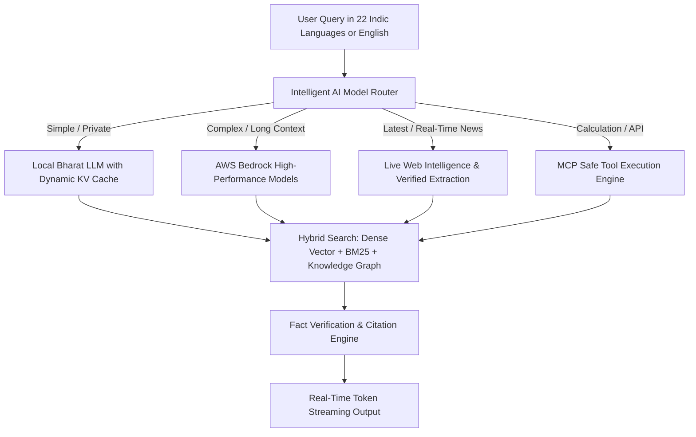

# System Architecture Audit Report: IndicLLM-Bharat

**Audit Timestamp**: `2026-08-22T09:03:58Z`  
**Operating Environment**: `Darwin 25.6.0 (arm64)`  
**Compute Accelerator**: `Apple Silicon MPS` (Apple Silicon GPU (MPS))  
**AWS Integration Status**: `CLI Available`

---

## 1. Executive Summary & Existing Subsystems

IndicLLM-Bharat is currently structured as an end-to-end sovereign foundation LLM platform containing:
- **Foundation Model Architecture**: `BharatForCausalLM` with Grouped-Query Attention (GQA), SwiGLU, RMSNorm, and YaRN RoPE (32k context).
- **Tokenization**: `BharatTokenizer` supporting 22 Scheduled Indian Languages + English (50k - 64k vocabulary).
- **Inference & Serving**: Standard HTTP/SSE streaming server (`bharat/serving/openai_server.py`) and Web Playground UI.
- **RAG & Tools**: Basic in-memory dense vector index (`bharat/rag/engine.py`) and safe Python/unit converter tool executor.
- **Safety & Constitutional AI**: Self-critique synthesis (`bharat/synthetic/constitutional.py`) and guardrail auditing.

---

## 2. Comprehensive Bottleneck Analysis

| Subsystem | Identified Bottleneck | Architectural Impact | Target Production Remedy |
|:---|:---|:---|:---|
| **Inference Engine** | Per-step tensor concatenation in generation loop | High CPU/VRAM reallocation overhead | Pre-allocated continuous KV Cache & Prompt Caching |
| **Model Routing** | Monolithic local model fallback only | High latency / failure on complex queries | Hybrid AI Router (Local $\leftrightarrow$ AWS Bedrock $\leftrightarrow$ Web) |
| **Knowledge Retrieval** | Pure dense vector search | Misses exact keywords (acronyms, names, codes) | Hybrid Retrieval (Dense Vector + BM25 + Knowledge Graph) |
| **Data Freshness** | Static knowledge baseline | Outdated responses on real-time queries | Live Web Retrieval & Continuous Ingestion Engine |
| **Tool Ecosystem** | Limited hardcoded tool functions | Lack of standard discovery protocol | MCP-Compatible Tool Registry & Multi-Step ReAct Loop |
| **Fact Verification** | No cross-source validation | Potential hallucination on conflicting data | Multi-Source Fact Checking & Grounded Citation Engine |
| **Caching Layer** | Zero query or semantic cache | Repeated compute & token waste | Exact, Semantic, Retrieval, and Prompt Caching |

---

## 3. Recommended Hybrid Architecture

