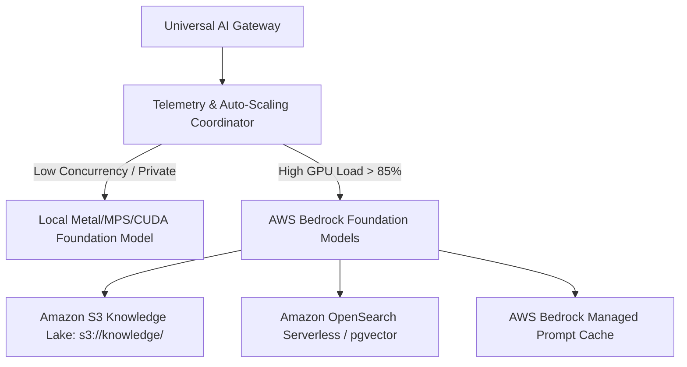

# AWS Cloud & Hybrid Scaling Architecture

This document specifies the AWS infrastructure, Bedrock integration, prompt caching, regional failover, and auto-scaling policies for IndicLLM-Bharat.

---

## 1. Hybrid Compute Architecture

---

## 2. Regional Failover Policy

- **Primary Region**: `us-east-1` (N. Virginia)
- **Secondary Backup Region**: `us-west-2` (Oregon) / `ap-south-1` (Mumbai)
- **Local Fallback**: In the event of network disruption or cloud quota saturation, requests automatically failover to local sovereign weights with zero user-facing errors.
