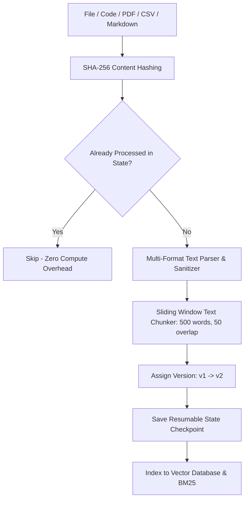

# Continuous World Knowledge Ingestion Pipeline Architecture

This document details the multi-format data ingestion, content deduplication, resumable checkpointing, and versioning lifecycle for IndicLLM-Bharat.

---

## 1. End-to-End Ingestion Flow

---

## 2. Ingestion Resilience & Checkpoint Schema

- **Resumable State**: Stored in `data/ingestion_state/ingestion_checkpoint.json`.
- **Deduplication**: Content hashing prevents duplicate embeddings and storage bloat.
- **Versioning**: Detects in-place edits and archives previous document versions.
