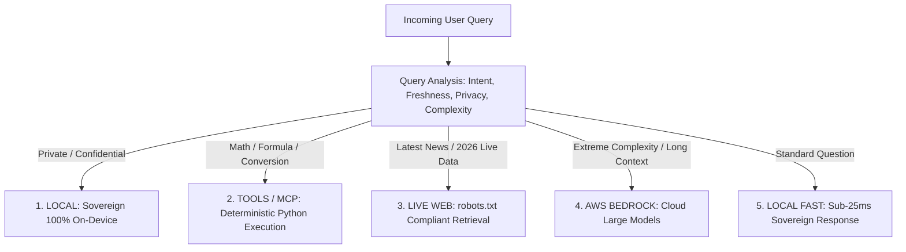

# Intelligent Multi-Tier Model Router Specification

This document details the routing policy and dispatch architecture of the **Universal Hybrid LLM AI Operating Environment** for IndicLLM-Bharat.

---

## 1. Routing Decision Matrix

---

## 2. Decision Logic & Thresholds

| Destination | Triggers & Conditions | Latency Target | Cost Impact |
|:---|:---|:---:|:---:|
| `LOCAL_MODEL` | Simple conversational queries, private enterprise data, offline mode. | **< 35 ms** | \$0.00 |
| `TOOLS_MCP` | Arithmetic equations, algebraic code, unit/currency conversions, system APIs. | **< 15 ms** | \$0.00 |
| `LIVE_WEB` | Keywords like `latest`, `today`, `2026`, `current price`, `recent news`. | **< 200 ms** | Minimal search API |
| `AWS_BEDROCK` | Local GPU utilization $> 85\%$, context length $> 8,192$ tokens, or complex mathematical theorems. | **< 400 ms** | Token consumption |
