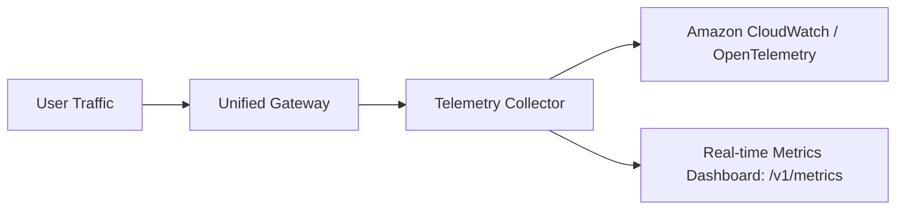

# Operations, Observability & Telemetry Manual

This document details the operational runbook, telemetry dashboards, health checks, and logging standards for IndicLLM-Bharat.

---

## 1. Health Endpoints & Telemetry Metrics

- **`GET /v1/health`**: Real-time heartbeat, GPU/MPS utilization, memory usage, and compute mode.
- **`GET /v1/metrics`**: Telemetry summary including TTFT, TPS, cache hit rate, and cloud cost breakdown.
- **`GET /v1/models`**: Active model tiers and external cloud backends.

---

## 2. Telemetry Architecture

