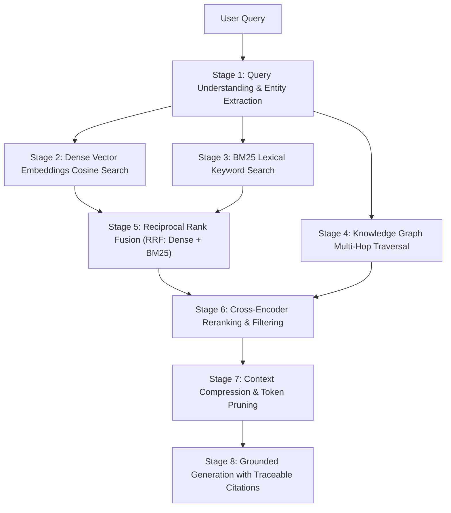

# Sovereign Multi-Stage Hybrid RAG Architecture

This document specifies the 8-stage hybrid retrieval architecture combining Dense Vector Search, BM25 Lexical Matching, Knowledge Graph Entity Traversals, Reciprocal Rank Fusion, and Context Compression.

---

## 1. Multi-Stage Retrieval Pipeline

---

## 2. Mathematical Formulation of Reciprocal Rank Fusion (RRF)

For each candidate document chunk $d$ across retrieval models $M = \{\text{dense}, \text{bm25}\}$:

$$RRF(d) = \sum_{m \in M} \frac{1}{k + r_m(d)}$$

where $k = 60$ is the smoothing constant, and $r_m(d)$ is the 1-based rank assigned by retrieval channel $m$.
