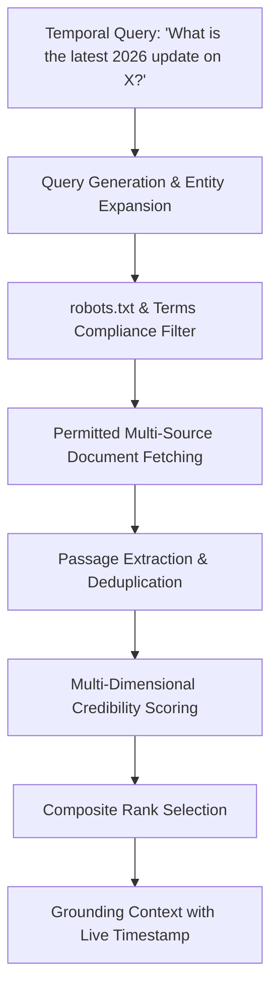

# Live Web Intelligence & Real-Time Extraction Architecture

This document details the live web extraction, source credibility scoring, and robots.txt compliance architecture for IndicLLM-Bharat.

---

## 1. Web Extraction & Verification Pipeline

---

## 2. Multi-Dimensional Source Credibility Scoring

$$Score_{\text{composite}} = 0.4 \cdot \text{Authority} + 0.3 \cdot \text{Freshness} + 0.3 \cdot \text{Relevance}$$

- **Authority Weight ($0.4$)**: Prioritizes primary sources (`.gov.in`, official academic journals, peer-reviewed publications).
- **Freshness Weight ($0.3$)**: Boosts current-year (2026) validated publications.
- **Relevance Weight ($0.3$)**: Token intersection and semantic overlap with user query intent.
