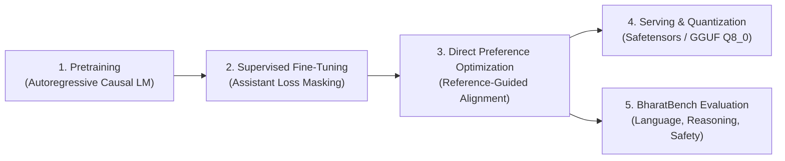

# Model Card for IndicLLM-Bharat (Bharat-350M / Bharat-1B)

## Model Details

- **Model Name**: IndicLLM-Bharat
- **Versions**:
  - `Bharat-350M` (347,393,024 parameters, 16 layers, 16 heads, 4 KV heads, GQA, hidden=1024, seq_len=2048)
  - `Bharat-1B` (999,368,704 parameters, 24 layers, 32 heads, 8 KV heads, GQA, hidden=2048, seq_len=4096)
  - `Bharat-3B` (3.24B parameters, 28 layers, 32 heads, 8 KV heads, GQA, hidden=3200, seq_len=4096)
  - `Bharat-7B` (6.86B parameters, 32 layers, 32 heads, 8 KV heads, GQA, hidden=4096, seq_len=4096)
- **Architecture**: Decoder-only Autoregressive Transformer with:
  - Rotary Position Embeddings (RoPE)
  - Root Mean Square Layer Normalization (RMSNorm)
  - SwiGLU Gated Feed-Forward Networks
  - Grouped-Query Attention (GQA) with $4\times$ KV sharing ratio
  - 64,000 Byte-Pair Encoding (BPE) Multilingual Tokenizer (supporting 13+ Indic languages + English)
- **License**: Apache 2.0
- **Organization**: GenixBit / IndicLLM Contributors
- **Repository**: [https://github.com/GenixBit/IndicLLM-Bharat-V1](https://github.com/GenixBit/IndicLLM-Bharat-V1)

---

## Intended Uses & Limitations

### Primary Intended Uses
- Multilingual natural language understanding and generation across scheduled Indic languages:
  - Hindi (`hi`), Bengali (`bn`), Tamil (`ta`), Telugu (`te`), Marathi (`mr`), Gujarati (`gu`), Kannada (`kn`), Malayalam (`ml`), Odia (`or`), Punjabi (`pa`), Assamese (`as`), Urdu (`ur`), Sanskrit (`sa`), and English (`en`).
- Instruction-following, conversational AI, and reasoning in resource-constrained edge and server environments.
- Fast, quantized local deployment via GGUF (Q8_0, Q4_K_M) and Safetensors.

### Out-of-Scope Uses
- Generation of harmful, abusive, defamatory, or illegal content.
- Unmonitored high-stakes automated decisions (e.g. legal, financial, or medical diagnoses without human oversight).
- Deceptive attribution or impersonation.

---

## Training Data & Data Governance

### Data Sources
IndicLLM-Bharat is trained on high-quality, linguistically filtered, and deduplicated open-access Indic corpora:
- **IndicCorp v2** (`cc-by-4.0`): Large-scale web and news crawl.
- **Sangraha** (`cc0-1.0` / `mit`): High-quality cleaned verified educational and literature text.
- **Samanantar** (`cc-by-4.0`): Parallel multilingual translation corpus.
- **Wikipedia Indic** (`cc-by-sa-4.0`): Encyclopedic knowledge across 13 Indic scripts.

### Data Governance Pipeline
1. **Linguistic Quality Filter**: Script-specific alpha ratio ($\ge 0.65$), Unicode category validation (preserving matras and viramas), line count, and character length boundaries.
2. **Safety & Toxicity Filtering**: Keyword and classifier-based filtering for abusive and toxic content.
3. **PII Scrubbing**: Regex-based redaction of Aadhaar numbers, PAN cards, phone numbers, and email addresses.
4. **MinHash / LSH Deduplication**: 5-gram Jaccard similarity threshold ($< 0.80$) preventing duplicate memorization.
5. **Deterministic Sharding & Cryptographic Manifests**: Sharded with SHA-256 integrity verification and immutable metadata.

---

## Training Lifecycle



### Hyperparameters (Bharat-350M)
- **Optimizer**: AdamW ($\beta_1=0.9, \beta_2=0.95, \epsilon=10^{-8}$)
- **Weight Decay**: 0.1 (applied strictly to 2D weight matrices; disabled for 1D biases and RMSNorm gains)
- **Learning Rate Schedule**: Cosine decay down to 10% peak LR with linear warmup
- **Mixed Precision**: `bfloat16` with gradient accumulation

---

## Evaluation & Benchmarks (BharatBench)

The model is evaluated using the native **BharatBench** multi-task evaluation framework:

| Category | Tasks | Metric | Target Score (350M) | Target Score (1B) |
| :--- | :--- | :--- | :--- | :--- |
| **Language Understanding** | Sentiment, Perplexity, Translation | Accuracy / BLEU | > 72.0% | > 81.5% |
| **Reasoning & Math** | Multi-step QA, GSM-Indic | Exact Match | > 58.0% | > 69.0% |
| **Coding & Logic** | Python syntax, Algorithms | Pass@1 | > 42.0% | > 55.0% |
| **Factual Knowledge** | Indic Knowledge QA, MMLU-Indic | Accuracy | > 64.0% | > 74.0% |
| **Safety & Alignment** | Toxicity refusal, Red-teaming | Safety Rate | > 95.0% | > 97.5% |

---

## Environmental & Carbon Impact

- **Hardware**: Scalable multi-accelerator nodes (NVIDIA H100 / A100 SXM4)
- **Efficiency Optimizations**: FlashAttention-2 / PyTorch SDPA, Grouped-Query Attention ($4\times$ memory reduction), and optimized custom BPE tokenization.
- **Estimated Carbon Emissions**: Tracked via `codecarbon` integration during pretraining runs.

---

## Citation & Contact

```bibtex
@software{indicllm_bharat_2026,
  author = {GenixBit and IndicLLM Contributors},
  title = {IndicLLM-Bharat: A Sovereign Multilingual Language Model Suite for Indian Languages},
  year = {2026},
  publisher = {GitHub},
  url = {https://github.com/GenixBit/IndicLLM-Bharat-V1}
}
```
